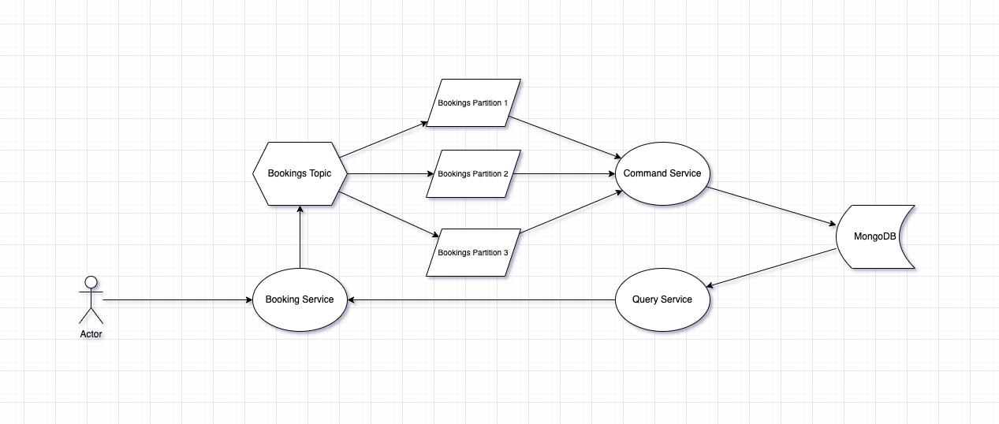

# Booking System

This project implements a booking system that allows users to reserve services for specific dates and times. Users can
choose a service, specify a desired date, and book a time slot for a specified duration (e.g., booking a service on
10.10.2024 from 13:00 for 1 hour).

This project is composed of multiple microservices that work together to implement a booking system. It
follows the **CQRS** (Command Query Responsibility Segregation) and **Data Sourcing** patterns. The **Data Sourcing**
pattern and its associated log are used to control concurrent bookings for the same date and time by multiple users,
ensuring data consistency and preventing conflicts.

## Request Types

### Command Requests

Command requests are used to modify the state of the MongoDB datastore. In other words, they are responsible for
creating and deleting bookings.

### Query Requests

Query requests are used to retrieve the current state of the MongoDB datastore. They provide users with a point in time
view of available and booked time slots. This view might be stale the moment it is viewed by users.

## Diagram



## Command Service

The **Command Service** consumes records from **Kafka** Topic Partitions, with each partition acting as a **Data
Sourcing**
log, serving as the authoritative source of truth for the application. This log preserves the chronological order of
booking commands, which is essential for ensuring fairness and consistency. By maintaining this order, it prevents race
conditions and conflicts between concurrent booking requests.

As the records are processed, the **Command Service** updates the state representation in **MongoDB**, creating
queryable data view for interested parties.

### Topic Partitioning

The partition key is based on the **ISO-8601** date format, ensuring that all bookings for a specific date are routed to
the same partition. This approach preserves the chronological order of bookings for that date, enabling the system to
accurately determine which user booked first.

## Query Service

The **Query Service** allows users to see their bookings. This serves as a way for checking whether a given booking
request was successful.

The service is also used for providing the users with information which bookings are currently not booked. This
information might very quickly become stale, but this is acceptable.

The **Booking Service** interacts with **Query Service** to perform users query requests.

### Swagger API Documentation

The **Query Service** API is fully documented using Swagger. You can explore the available endpoints, their parameters,
and responses directly in the Swagger UI. This provides an interactive interface to test the API and understand the
request/response structures.

- [Swagger UI](https://petstore.swagger.io/?url=https://raw.githubusercontent.com/mat-sik/booking-service/refs/heads/main/query-service/api-docs.yaml)
- [Raw API File](query-service/api-docs.yaml)

## Booking Service

The **Booking Services** serves as an entry point for the application. It provides REST API to interact with the system.

### Swagger API Documentation

The **Booking Service** API is fully documented using Swagger. You can explore the available endpoints, their parameters,
and responses directly in the Swagger UI. This provides an interactive interface to test the API and understand the
request/response structures.

- [Swagger UI](https://petstore.swagger.io/?url=https://raw.githubusercontent.com/mat-sik/booking-service/438095b02009952554ab3a60458ea83fe2daf9ca/booking-service/api-docs.yaml)
- [Raw API File](booking-service/api-docs.yaml)

## MongoDB data model

`service_bookings Collection`

```json
{
  "_id": "objectid",
  "date": "string",
  "serviceId": "objectid",
  "bookings": [
    {
      "_id": "objectid",
      "userId": "objectid",
      "start": "int32",
      "end": "int32"
    }
  ]
}
```

The `date` field represents the date in the format: **ISO-8601** the same one as in the **Kafka** partition key.

The field In combination with the`serviceId` field, uniquely identifies a list of bookings of a services for a
single day.

The `bookings` field contains a list with objects representing all present bookings.

The `start` and `end` fields have type int32, representing the number of minutes from the 00:00.

## Command Requests

All requests are designed with independence in mind, ensuring consistency by leveraging the at-least-once delivery
guarantee.

### Inserting new booking

To fulfill the request of creating a new booking, the availability of the booking needs to be checked.

Given input parameters:

- `date`- **ISO-8601**
- `serviceId` - id of the servcie for the booking
- `start`- start time of the booking
- `end`  - end time of the booking
- `userId` - id of the user issuing the booking
- `_id` - new objectid of the booking.

First check if a document for a given `date` and `serviceId` already exists, if it does, do nothing, else create new
document with empty `bookings` list.

For document matching `date` and `serviceId`

For every `booking` : `bookings`

Check `input.start < booking.end && input.end > booking.start`

This condition allows for overlapping time ranges, but ranges with the same start and end time (e.g.,
`start: 660, end: 660`) should be ignored. While we could use the condition
`input.start <= booking.end && input.end >= booking.start`, it would require using ranges like `600-660`, `661-761`,
etc., which would introduce unnecessary gaps between adjacent ranges. The current condition allows for adjacent time
slots such as `540-600`, `600-660`, `660-720` without the need for these gaps.

If none is found, push the input object into `bookings` array.

**Implementation**:

```
const newBooking = {
  _id: new ObjectId(),
  userId: new ObjectId(),
  start: 600,
  end: 660,
};

db.service_bookings.updateOne(
  { 
    "date": "03/12/2024", 
    "serviceId": ObjectId("your-service-id") 
  }, 
  { 
    "$setOnInsert": { 
      "date": "03/12/2024", 
      "serviceId": ObjectId("your-service-id"), 
      "bookings": [] 
    } 
  }, 
  { upsert: true }
)

db.service_bookings.updateOne(
  {
    date: "03/12/2024",
    serviceId: ObjectId("your-service-id"),
    $expr: {
      $not: {
        $anyElementTrue: {
          $map: {
            input: "$bookings",
            in: {
              $and: [
                { $lt: [newBooking.start, "$$this.end"] },
                { $gt: [newBooking.end, "$$this.start"] },
              ],
            },
          },
        },
      },
    },
  },
  {
    $push: { bookings: newBooking },
  }
);
```

For the best performance, `date` and `serviceId` fields should be used in a composite index, to allow fast fetching of
the documents.

The check for overlap of bookings will be performed in memory. There won't be that many bookings in a single day, so
it is acceptable.

Unfortunately, two queries are required because the `upsert` operation does not work with `$expr` within the same query.
This results in a performance hit compared to using a single query. Additionally, this approach could introduce
concurrency issues if we didn't ensure that all records for a given day are stored on the same log.

For example, consider user A, whose first query creates a new document. If user A loses their time slice in the
meantime, user B could run both queries successfully, effectively booking the service before user A. Although user A was
technically first, he would not successfully book the service.

In practice, this scenario is invisible to the users, so it is not a significant concern.

### Deleting an existing booking

Deleting a booking is simpler than inserting one because there is no need to check for conflicts.

The parameters for `date`, `serviceId` and `_id` of the booking are needed.

```
const bookingIdToDelete = new ObjectId("booking-id-to-delete");

db.service_bookings.updateOne(
  {
    date: "03/12/2024",
    serviceId: ObjectId("your-service-id"),
  },
  {
    $pull: { bookings: { _id: ObjectId("your-booking-id") } }
  }
);
```

### Updating an existing booking

To fulfill this requirement, the booking should first be deleted, and then a new booking should be created. However,
there is no guarantee that the creation will succeed.

## Query Requests

### Get information about a single booking

Query:

```
db.service_bookings.aggregate([
{
    $match: {
        date: "03/12/2024",
        serviceId: ObjectId("aaaaaaaaaaaaaaaaaaaaaaaa")
    }
},
{
    $unwind: "$bookings"
},
{
    $project: {
        _id: "$bookings._id",
        userId: "$bookings.userId",
        start: "$bookings.start",
        end: "$bookings.end"
   }
},
{
    $match: {
        "_id": ObjectId("67500fcd910fab08c24c4ac1")
    }
},
{
    $project: {
        _id: 0 
   }
}
]);
```

Output:

```
[
  {
    userId: ObjectId('bbbbbbbbbbbbbbbbbbbbbbbb'),
    start: 540,
    end: 600
  }
]
```

### Get all bookings of a list of users for a list of dates and a list of services

This query usually is used with multiple dates, single serviceId and single userId.

But additional functionality might prove useful when extending the application.

Query:

```
db.service_bookings.find(
{
    date: {
        $in: ["03/12/2024", "04/12/2024"] 
    },
    serviceId: {
        $in: [ObjectId("aaaaaaaaaaaaaaaaaaaaaaaa")]
    }
},
{
   date: 1,
   serviceId: 1,
   bookings: {
       $filter: {
           input: "$bookings",
           cond: {
                $in: ["$$this.userId", [ObjectId("bbbbbbbbbbbbbbbbbbbbbbbb")]]
           }    
       }  
   } 
}
);
```

Output:

```
[
  {
    _id: ObjectId('67500fbf03727dde1663113a'),
    date: '03/12/2024',
    serviceId: ObjectId('aaaaaaaaaaaaaaaaaaaaaaaa'),
    bookings: [
      {
        _id: ObjectId('67500fcd910fab08c24c4ac1'),
        userId: ObjectId('bbbbbbbbbbbbbbbbbbbbbbbb'),
        start: 540,
        end: 600
      },
      {
        _id: ObjectId('67501009d8dd2b769e43560c'),
        userId: ObjectId('bbbbbbbbbbbbbbbbbbbbbbbb'),
        start: 600,
        end: 660
      },
      {
        _id: ObjectId('6750101e3f68f50a6bcd7b58'),
        userId: ObjectId('bbbbbbbbbbbbbbbbbbbbbbbb'),
        start: 660,
        end: 720
      }
    ]
  },
  {
    _id: ObjectId('6750348003727dde1663113b'),
    serviceId: ObjectId('aaaaaaaaaaaaaaaaaaaaaaaa'),
    date: '04/12/2024',
    bookings: []
  }
]
```

### Get all available time ranges with a specified length and skip for a given day and a service

To fulfill this request, the query should retrieve all booking time ranges for a specified date and service.

Query:

```
db.service_bookings.aggregate([
{
    $match: {
        date: "03/12/2024",
        serviceId: ObjectId("aaaaaaaaaaaaaaaaaaaaaaaa")
    }
},
{
    $unwind: "$bookings"
},
{
    $project: {
        start: "$bookings.start",
        end: "$bookings.end"
   }
}
]);
```

Output:

```
[
  { _id: ObjectId('67500fbf03727dde1663113a'), start: 540, end: 600 },
  { _id: ObjectId('67500fbf03727dde1663113a'), start: 600, end: 660 },
  { _id: ObjectId('67500fbf03727dde1663113a'), start: 660, end: 720 },
  { _id: ObjectId('67500fbf03727dde1663113a'), start: 720, end: 780 }
]
```

## Helper Modules

To streamline the integration of microservices, I created several helper modules:

### `commons-models`

This module defines common data models for bookings, providing a standardized structure that is shared across the
system.

### `commons-json`

This module includes common Jackson configurations and classes that represent API responses. The response classes are
used, for example, in the **Query Service** and **Booking Service** to ensure consistent response structures.

### `commons-kafka`

This module, like `commons-json`, provides shared Kafka configurations and defines classes for Kafka message values. It
ensures consistent Kafka message formats and configurations across the **Command Service** and **Booking Service**.
