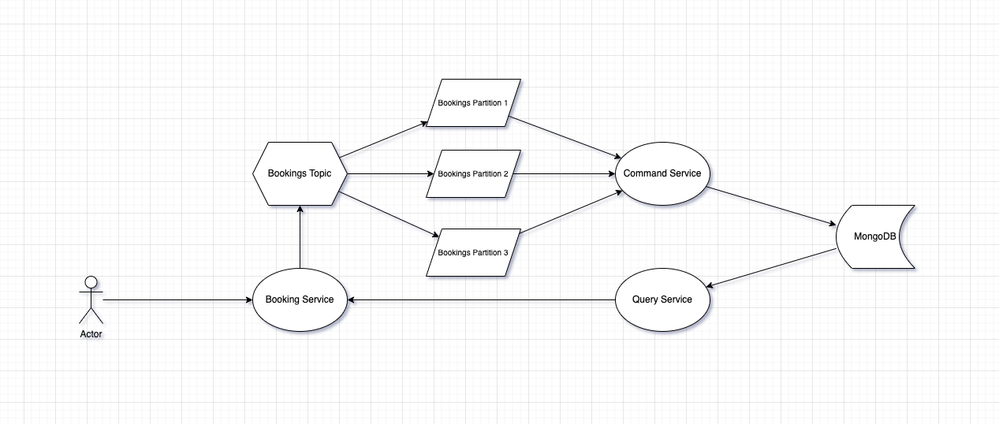

# Booking System

A highly scalable, event-driven booking system built with microservices architecture, enabling users to reserve services for specific dates and times with guaranteed consistency and no double-bookings.

## Table of Contents

- [Overview](#overview)
- [Architecture](#architecture)
- [Key Features](#key-features)
- [Quick Start](#quick-start)
- [API Documentation](#api-documentation)
- [Deployment](#deployment)
   - [Docker Compose](#docker-compose)
   - [Kubernetes](#kubernetes)
- [Load Testing](#load-testing)
- [Development](#development)
- [Monitoring & Observability](#monitoring--observability)

## Overview

This booking system allows users to reserve services for specific time slots (e.g., booking a massage service on October 10, 2024 from 13:00 for 1 hour). The system guarantees no concurrent bookings for the same service and time through careful partitioning and event-driven architecture.

### Built With

- **Java** - Core application language
- **Apache Kafka** - Event streaming and command processing
- **Apache Cassandra** - Distributed NoSQL database
- **gRPC** - Inter-service communication
- **Docker & Kubernetes** - Container orchestration
- **Observability Stack** - OpenTelemetry, Grafana, Prometheus, Tempo, Loki

## Architecture

The system implements **CQRS** (Command Query Responsibility Segregation) to separate write operations from read operations, enabling optimal scaling of each concern independently.



### Microservices

#### Command Service
Processes booking commands (create/delete) from Kafka topic partitions. Each partition acts as an append-only log ensuring chronological ordering and preventing race conditions.

**Key Features:**
- In-memory cache for each kafka consumer synchronized with Cassandra table partition for fast booking availability validation
- Partition-based concurrency control
- Horizontally scalable with configurable consumer threads

#### Query Service
Handles read operations for retrieving booking information via gRPC.

**Capabilities:**
- View user bookings
- Check available time slots
- Service status queries

#### Booking Service
REST API gateway providing the external interface to the system.

**Responsibilities:**
- HTTP endpoint exposure
- Request routing to Command/Query services
- API documentation via Swagger

### Topic Partitioning Strategy

Partition keys combine date (ISO-8601) and service UUID, ensuring:
- All bookings for a service on a given date route to the same partition
- Chronological ordering is maintained
- First-come-first-served fairness
- Independent processing of different services/dates

### Design Principles

- **Hexagonal Architecture** - Clean separation of business logic from infrastructure
- **Event Sourcing** - Kafka partitions as source of truth
- **CQRS** - Optimized read and write paths
- **Horizontal Scalability** - Add partitions and nodes as needed
- **High Availability** - Multi-node Cassandra cluster with replication

## Key Features

✅ **No Double Bookings** - Guaranteed through Kafka partition ordering  
✅ **High Scalability** - Independent scaling of command/query services  
✅ **Full Observability** - Traces, logs, and metrics via OpenTelemetry  
✅ **Production Ready** - Kubernetes deployment with Helm charts  
✅ **Integration Tested** - Comprehensive tests using Testcontainers  
✅ **Load Tested** - Locust-based performance testing mimicking real users

## Quick Start

### Prerequisites

- Docker and Docker Compose (for local deployment)
- OR Minikube, kubectl, and Helm 3.x (for Kubernetes deployment)

### Option 1: Docker Compose (Recommended for Development)

1. Clone the repository:
```bash
git clone <repository-url>
cd booking-system
```

2. Start all services:
```bash
docker compose up -d
```

3. Access the services:
   - **Booking API**: http://localhost:8080
   - **Grafana Dashboard**: http://localhost:3000 (admin/admin)

4. Try the API using [Swagger UI](https://petstore.swagger.io/?url=https://raw.githubusercontent.com/mat-sik/booking-system/refs/heads/main/booking-service/api-docs.yaml)

### Option 2: Kubernetes with Minikube

See the [Kubernetes Deployment](#kubernetes) section for detailed instructions.

## API Documentation

Explore the full REST API documentation:
- **[Interactive Swagger UI](https://petstore.swagger.io/?url=https://raw.githubusercontent.com/mat-sik/booking-system/refs/heads/main/booking-service/api-docs.yaml)** - Test endpoints directly
- **[Raw OpenAPI Spec](booking-service/api-docs.yaml)** - YAML specification

The API supports CORS for seamless integration with Swagger UI.

### Request Types

**Command Requests** - Modify state (create/delete bookings)

**Query Requests** - Retrieve state (read-only operations)

## Deployment

### Docker Compose

#### Building Images

Build individual service images from the repository root:

```bash
# Query Service
docker build -f ./query-service/Dockerfile . -t booking-system-query-service

# Command Service
docker build -f ./command-service/Dockerfile . -t booking-system-command-service

# Booking Service
docker build -f ./booking-service/Dockerfile . -t booking-system-booking-service
```

#### Running the Stack

```bash
docker compose up -d
```

#### Stopping the Stack

```bash
docker compose down
```

### Kubernetes

#### Prerequisites

- Minikube running
- kubectl configured for Minikube context
- Helm 3.x installed
- Docker images built

#### Step 1: Create Namespace

```bash
kubectl create namespace booking-system
kubectl config set-context minikube --namespace=booking-system
```

#### Step 2: Load Images into Minikube

```bash
for img in query-service command-service booking-service; do
  minikube image load booking-system-$img
done
```

#### Step 3: Prepare Persistent Volumes

```bash
minikube ssh

sudo rm -rf /mnt/data &&

# Cassandra data
sudo mkdir -p /mnt/data/cassandra-0 &&
sudo chown 999:999 /mnt/data/cassandra-0 &&

# Prometheus data
sudo mkdir -p /mnt/data/prometheus-0 &&
sudo chown 65534:65534 /mnt/data/prometheus-0 &&

# Tempo data
sudo mkdir -p /mnt/data/tempo-0 &&
sudo chown 10001:10001 /mnt/data/tempo-0 &&

# Loki data
sudo mkdir -p /mnt/data/loki-0 &&
sudo chown 10001:10001 /mnt/data/loki-0 &&

# General purpose volumes
for i in {0..4}; do
  sudo mkdir -p /mnt/data/pv-$i
done &&

# Set permissions
sudo chmod 700 /mnt/data/* &&

exit
```

#### Step 4: Build Helm Dependencies

```bash
helm dependency build ./helm/infra
helm dependency build ./helm/observability/grafana
helm dependency build ./helm/observability/loki
helm dependency build ./helm/observability/opentelemetry-collector
helm dependency build ./helm/observability/prometheus
helm dependency build ./helm/observability/tempo
```

#### Step 5: Install Infrastructure

```bash
# Install infrastructure components
helm install booking-system-infra ./helm/infra -n booking-system

# Install observability stack
helm install booking-system-observability-grafana ./helm/observability/grafana -n booking-system
helm install booking-system-observability-loki ./helm/observability/loki -n booking-system
helm install booking-system-observability-opentelemetry-collector ./helm/observability/opentelemetry-collector -n booking-system
helm install booking-system-observability-prometheus ./helm/observability/prometheus -n booking-system
helm install booking-system-observability-tempo ./helm/observability/tempo -n booking-system
```

#### Step 6: Deploy Application Services

```bash
kubectl apply -f ./k8s -n booking-system
```

#### Port Forwarding for Local Access

```bash
# Grafana (http://localhost:3000 - admin/admin)
kubectl port-forward service/booking-system-observability-grafana 3000:80 -n booking-system

# Booking API (http://localhost:8080)
kubectl port-forward service/booking-service 8080:8080 -n booking-system

# Cassandra (localhost:9042)
kubectl port-forward service/cassandra 9042:9042 -n booking-system
```

#### Uninstalling

```bash
# Remove Helm releases
helm uninstall booking-system-infra -n booking-system
helm uninstall booking-system-observability-grafana -n booking-system
helm uninstall booking-system-observability-loki -n booking-system
helm uninstall booking-system-observability-opentelemetry-collector -n booking-system
helm uninstall booking-system-observability-prometheus -n booking-system
helm uninstall booking-system-observability-tempo -n booking-system

# Clean up resources
kubectl delete -f ./k8s -n booking-system
kubectl delete pvc broker-kafka-broker-controller-0 -n booking-system
kubectl delete pvc cassandra-cassandra-0 -n booking-system
kubectl delete pvc storage-booking-system-observability-tempo-0 -n booking-system
```

## Load Testing

The system includes realistic load tests built with Locust that simulate actual user behavior.

### Running Load Tests

1. Navigate to the load tests directory:
```bash
cd load-tests
```

2. Set up the Python environment:
```bash
source venv/bin/activate
pip install -r requirements.txt
```

3. Start Locust (ensure booking service is accessible):
```bash
locust -f locustfile.py --host=http://localhost:8080
```

4. Open the Locust web interface: http://localhost:8089

5. Configure your test parameters and start swarming!

## Development

### Helper Modules

**commons-models** - Shared data models and Cassandra table structures  
**commons-kafka** - Kafka message formats, serializers, and deserializers  
**commons-grpc-query-service** - Proto definitions and gRPC common utilities

### Running Tests

Integration tests use Testcontainers for realistic testing:

```bash
./mvnw test
```

### Code Architecture

Command and Query microservices follow **Hexagonal Architecture** principles.

- **Domain Layer** - Core business logic
- **Port Layer** - Interfaces to decouple **Domain Layer** from **Adapters Layer**
- **Adapter Layer** - External dependencies (Kafka, Cassandra, gRPC)

This separation ensures maintainability and testability.

## Monitoring & Observability

### Stack Components

- **OpenTelemetry Collector** - Receives and processes telemetry data
- **Tempo** - Distributed tracing backend
- **Loki** - Log aggregation
- **Prometheus** - Metrics collection
- **Grafana** - Unified visualization dashboard

### Accessing Grafana

1. Port forward the service (if using Kubernetes):
```bash
kubectl port-forward service/booking-system-observability-grafana 3000:80 -n booking-system
```

2. Open http://localhost:3000
3. Login with `admin` / `admin`
4. Explore pre-configured dashboards for traces, logs, and metrics

### Custom Instrumentation

Each microservice includes custom spans and metrics for deep observability into:
- Booking request processing times
- Cache hit/miss rates
- Partition processing latency
- Kafka consumer lag
- Cassandra query performance

## Operations

### Cassandra Management

**Check cluster status:**
```bash
kubectl exec cassandra-0 -n booking-system -- nodetool status
```

**View node information:**
```bash
kubectl exec cassandra-0 -n booking-system -- nodetool info
```

**Scaling the cluster:**
1. Create additional PVs for new nodes
2. Update the StatefulSet replica count
3. Add new seed nodes to `CASSANDRA_SEEDS` environment variable

### Kafka Management

**View metadata quorum status:**
```bash
kubectl exec -n booking-system kafka-broker-controller-0 -- /opt/kafka/bin/kafka-metadata-quorum.sh \
  --bootstrap-server kafka-broker-controller-0.kafka-broker-controller.booking-system.svc.cluster.local:9092 \
  describe --status
```

**List all brokers:**
```bash
kubectl exec -n booking-system kafka-broker-controller-0 -- /opt/kafka/bin/kafka-broker-api-versions.sh \
  --bootstrap-server kafka-broker-controller-0.kafka-broker-controller.booking-system.svc.cluster.local:9092
```

### Network Inspection

```bash
# View all services
kubectl get svc -n booking-system

# View endpoint slices
kubectl get endpointslice -n booking-system
```

## Troubleshooting

**Issue: Pods not starting**
- Check PV permissions match the container user IDs
- Verify images are loaded into Minikube: `minikube image ls`

**Issue: Kafka connection errors**
- Confirm bootstrap servers are reachable
- Check DNS resolution: `kubectl exec <pod> -- nslookup kafka-broker-controller`

**Issue: Booking conflicts despite partitioning**
- Verify partition key generation logic
- Check Kafka consumer group coordination

## License

This project is licensed under the MIT License - see the [LICENSE](LICENSE) file for details.

You are free to use, modify, and distribute this software for personal or commercial purposes.

## Contact

For questions, suggestions, or issues, feel free to reach out:

- **Email**: mateusz0.sikorski@outlook.com
- **LinkedIn**: [Mateusz Sikorski](https://www.linkedin.com/in/mateusz-sikorski-0x01/)

We appreciate your feedback and contributions!
